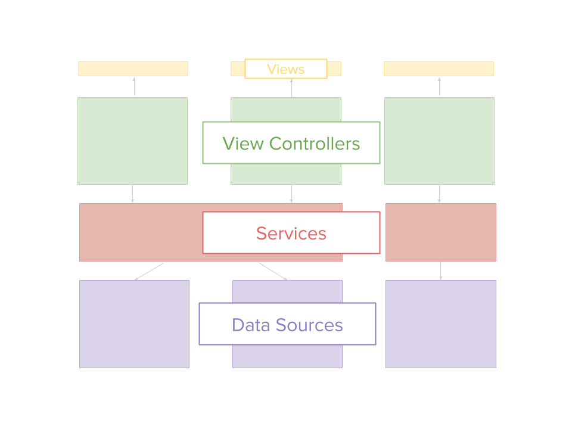

# iOS

## A quick intro into how the Charter iOS app is structured

This structure isn’t groundbreaking, but I thought it might be worth putting a few words here so that you can familiarise yourself with the codebase a little more quickly.

But first, one of those generic diagrams that might be helpful?

Alright.

I think the Charter iOS codebase has four important parts.

First, **the coordinators**. Right now, this just consists of a single app coordinator. This isn’t pictured above since it’s really part of the view controller layer. The app coordinator is responsible for making sure the navigation flow is right (i.e. if you tap a cell, the view controller that got tapped can tell the app coordinator what got tapped, and then the app coordinator decides what to display next) and for making sure that the other classes have access to what they need to get stuff done (so if we need a service to get emails from the network, it’s the app coordinator’s job to make sure the service has a cache and a network data source it can use—dependency injection). These are two fairly distinct responsibilities, so we could probably refactor this class if it got too big, but they fit together so nicely.

Second, **the services**. If you need something, a service will get it for you. (No questions asked.) To a view controller, the service is the be-all-and-end-all for getting the data it wants to display. A service might get some data from the networking class, tell another class to save that data to a cache, and give the data back to the view controller that wants it. The next time it might just send the cached data back. A service is like a little consigliere for the rest of the app.

So how do the services actually get their data? The **data sources**. A data source takes care of some third party entity so that the service doesn’t have to get its hands dirty. Right now, we’ve got a data source for networking and one for caching. These are not to be confused with the data source to something like a table view, which are really part of the view controller layer (and are usually named `*ViewControllerDataSource`).

And now the much hated **view controllers**. These will ask a service for something, the service will give something back to them, and the view controller gives it to a view, maybe reformatting it along the way. If formatting gets to be a big chore, we might create a class just to handle that reformatting; or if we have a lot of data and change to handle, we might make a view controller data source for that view controller.

We put this stuff together with protocols. Just about everything starts as a protocol, and then we create an implementation once we know how it’s going to interact with the rest of the app. Need a networking data source? Create a `NetworkDataSource` protocol that tells the service what this class promises to do. Then we create a `RESTNetworkDataSource` class that actually does the hard yards. 

A couple of other points of interest:

* we have this weird `Utility` cloud of stuff like extensions and convenient methods. It’s not really that important.
* we keep our tests right next to the class file in the file system, rather than in a `Tests` directory. This helps you see right away what the test coverage for a certain class might be, and just generally makes navigating from implementation to unit test a lot easier.
